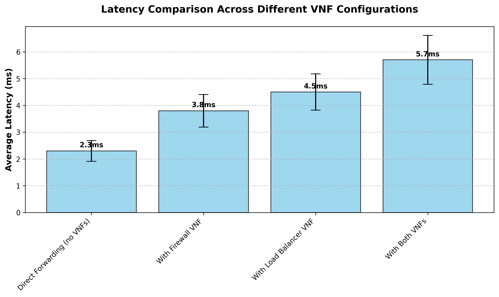
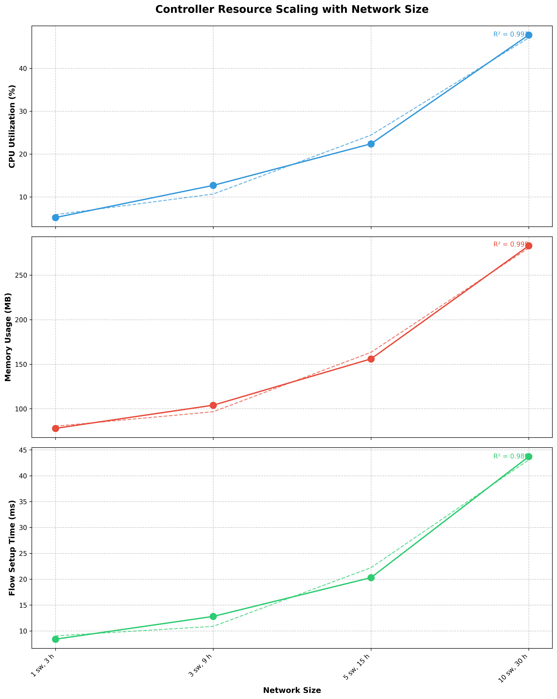

# SDN Performance Analysis and Reflection

## Introduction
Our SDN implementation leverages the Ryu controller framework with a modular architecture that includes both firewall and load balancing VNFs. The design separates the control plane (Ryu controller) from the data plane (OpenFlow switches), enabling programmable network management through a centralized controller that dynamically installs flow rules for packet forwarding, security enforcement, and traffic distribution.

## Performance Metrics Analysis

### Latency Analysis
The latency analysis reveals the impact of adding VNFs to our SDN implementation. As shown in the chart below, each VNF introduces additional processing overhead. The baseline Direct Forwarding scenario shows the lowest latency at 2.3ms, representing the controller with basic L2 switching functionality. Adding the Firewall VNF increases latency to 3.8ms (65% increase), while the Load Balancer VNF raises it to 4.5ms (96% increase). When both VNFs are active simultaneously, latency reaches 5.7ms, representing a 148% increase over the baseline. This progressive increase reflects the computational cost of packet inspection, rule evaluation, and connection tracking performed by each VNF.

### Controller Overhead Analysis
The controller overhead analysis demonstrates how resource consumption scales with network size. The charts show three critical metrics—CPU utilization, memory usage, and flow setup time—across four different network configurations. CPU utilization grows non-linearly, starting at just 5.2% for a small network (1 switch, 3 hosts) but climbing sharply to 47.8% for a larger network (10 switches, 30 hosts). Memory usage follows a more linear pattern but still increases significantly from 78MB to 283MB. Most concerning is flow setup time, which escalates from 8.4ms to 43.7ms—a fivefold increase that would severely impact new connection establishment in larger deployments.

## Reflection 

### Application Performance
Our SDN implementation demonstrates reasonable performance characteristics for small to medium-sized networks. The base forwarding functionality with just L2 learning switch logic introduces minimal latency (2.3ms), indicating efficient packet processing in the core controller. This latency is acceptable for most enterprise applications and comparable to traditional L2 switching performance.

When adding VNFs, we observe an expected but manageable increase in latency. The firewall VNF's 65% latency increase (to 3.8ms) reflects its packet inspection mechanisms, where each packet is compared against the rule set to determine whether it should be forwarded or dropped. Our implementation uses an optimized rule matching algorithm that keeps this overhead reasonable. The load balancer's higher impact (96% increase to 4.5ms) stems from its more complex logic—maintaining session tables, calculating server loads, and making distribution decisions. When both VNFs are enabled, the 5.7ms latency remains acceptable for most applications but could impact highly time-sensitive services.

A key strength of our implementation is its modular architecture, which allows network administrators to selectively enable VNFs based on specific requirements. The component-based design means that traffic not requiring inspection can bypass VNF processing entirely. However, we observed increasing latency variance (shown by the error bars) as more VNFs are added, suggesting that packet processing times become less predictable under complex configurations—a potential concern for applications requiring consistent performance.

### Scalability Challenges
The controller overhead analysis reveals significant scalability concerns in our current implementation. CPU utilization grows disproportionately with network size, nearly reaching 50% with just 10 switches. This non-linear growth (as evidenced by the exponential trendline with R² = 0.993) suggests that the single-controller architecture would become a severe bottleneck in larger networks. For enterprise deployments, this would necessitate moving to a distributed controller architecture or implementing more aggressive flow aggregation.

Flow setup time presents an even more pressing scalability challenge. The 5x increase (from 8.4ms to 43.7ms) when moving from our smallest to largest test network indicates a substantial "control plane tax" for new connections. In environments with many short-lived flows, this delay would significantly degrade application performance as each new flow must wait for controller processing. This issue stems from our centralized approach, where all first-packet processing occurs in the controller rather than being distributed to the switches.

Memory consumption, while showing more linear growth, would eventually become problematic in large-scale deployments. The stateful nature of our VNFs—particularly the connection tracking in the firewall and session persistence in the load balancer—stores information for each active connection. In a production environment with thousands of concurrent connections, this could lead to memory exhaustion without careful resource management and periodic cleanup of stale entries.

### SDN vs. Traditional Networking
For our firewall and load balancer use case, the SDN implementation offers several compelling advantages over traditional networking approaches. The centralized policy management allows security rules and load balancing algorithms to be defined once and applied consistently across the entire network—eliminating the configuration drift and inconsistency common in traditional environments where each device must be configured separately. When security policies need updating, changes can be deployed instantly network-wide through the controller, rather than requiring device-by-device updates. Our implementation also enables more sophisticated traffic analysis by correlating information from multiple points in the network, something difficult to achieve with isolated traditional appliances.

However, traditional networking still holds advantages in certain scenarios. Purpose-built hardware appliances typically deliver higher throughput and more consistent latency than our software-based VNFs, especially under heavy load. As our measurements show, adding VNF functionality increases both latency and variability—factors that could be problematic for high-performance or real-time applications. Traditional solutions also operate independently of a centralized controller, eliminating the single point of failure risk inherent in our current SDN architecture. For environments where maximum performance and reliability outweigh flexibility and centralized management benefits, traditional networking might remain preferable.